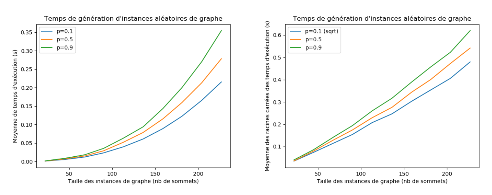
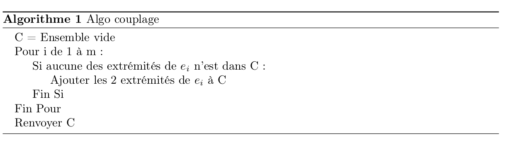
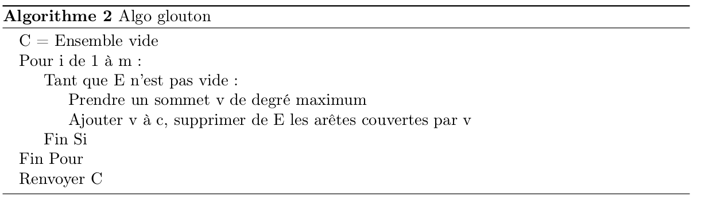
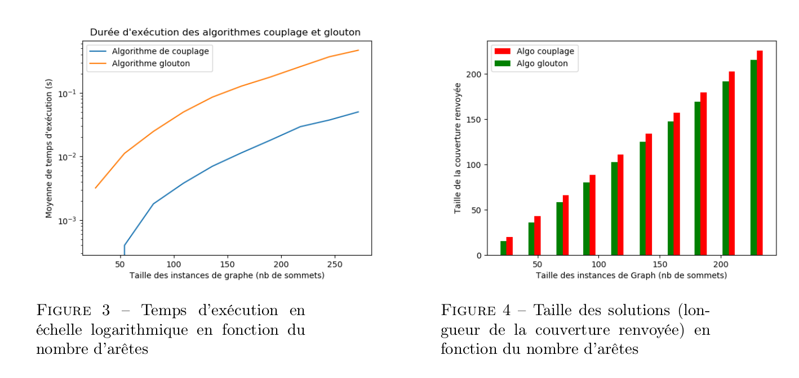
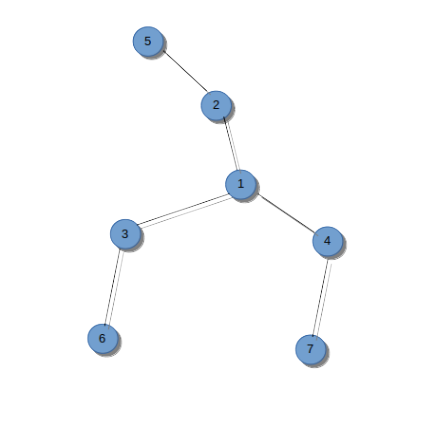

# Probleme-de-couverture-de-Graph ***Vertex Cover***

## Objectif: 

Le but de ce ce projet est d’implémenter différents algorithmes **Exacts** ,**Approchés**, s**éparation et évaluation (branch and Bound)**
pour résoudre le problème ***Vertex Cover***, et de les tester expérimentalement sur différentes instances.

(Voir fichier couverture_graph.pdf pour plus de détails sur la problématique.)

## Introduction

### Définitions :

* Soit un graphe G= (V, E) non orienté, où V est l’ensemble des n sommets et E l’ensemble des m arêtes de G. 
* Une couverture de G est un ensemble V’⊆ V tel que toute arête e ∈ E a (aumoins) une de ses extrémités dans V.
*
* Le but du problème **Vertex Cover** est de trouver une couverture contenant un nombre mi-nimum de sommets. 

### Vertex-Cover est un problème NP-complet :

* Ce problème est **NP-difficile** (sa version décision est NP-complète), cela semontre par réduction du problème NP-complet **Clique**.

* Preuve **Certificat** :La couverture du graphe est un certificat.
* On peut vérifier en temps polynomialqu’un ensemble de sommets V est bien une couverture du graphe en vérifiant par exemple pourchaque arête du graphe l’existence d’un sommet v ∈ V qui lui est adjacent.

* **Réduction** :L’existence d’une couverture V de taille de k du graphe G est équivalente à l’existence d’une clique de taillen−k dans le graphe complémentaire Gc de G.

## Implémentation : 

### Choix d’implémentation : 

* Nous avons décidé d’implémenter notre classe Graph en **Python**. Ce choix est principalementmotivé par les facilités d’implémentations offertes par Python dans le cadre de notre problème.En effet, il n’y a pas **d’allocation mémoire** à gérer comme cela aurait pu être le cas dans d’autres languages (C) et la structure de liste et de dictionnaire en python est particulièrement **simple d’utilisation** tout en restant adaptée à notre problème. 

* C’est donc une représentation d’un graphe sous forme de **liste d’adjacence** que nous avons choisi.
* **Attributs de la classe Graph** :
     * Un tableau dans lequel on stocke les noeuds du graphe.
     * Un dictionnaire associant à chaque noeud du graphe la liste de ses voisins.
* **Méthodes de base définies dans la classe Graph** :
     
     * Une fonction renvoyant la taille du graphe (nombre de sommets).
     * Des fonctions d’ajout et de suppression de noeuds et d’arêtes
     * Des fonctions permettant d’obtenir le degré d’un noeud donné en argument, le noeud dedegré maximal du graphe ainsi que le degré associé.
     * Une fonction permettant de copier un graphe
     * Une fonction prenant en entrée un entiern> 0 et un paramètre 0<p<1 et qui renvoie un graphe sur n sommets où chaque arête (i, j) est présente avec probabilité 
 
### Protocole expérimental :

Dans tous les tests expérimentaux que nous présenterons par la suite, nous appliquerons le protocole expérimental suivant :

* Toutes nos fonctions auront au moins 2 attributs **inst** et **inter**,
* inst représentant le nombred’instances sur lequel nous voulons tester une fonction.
* inter représentant le nombre defois que nous testerons la fonction pour une instance donnée.
* Pour chaque instance, nous testons inter fois la fonction avant de faire une moyenne arithmétique sur le résultat obtenu. Cela permet d’améliorer la précision des tests.

### Premier Test Experimental : Génération des graphes aléatoires en fonction de nombre de sommets :

* Dans notre premier test expérimental, nous traçons la durée d’exécution de notre fonction permettant de générer des graphes aléatoires en fonction du nombre de sommets. 

* Nous traçons plusieurs graphes correspondant à des probabilités d’apparition des arêtes différentes (Nous avonschoisi 0.1, 0.5 et 0.9).

Voici les résultats obtenus:

  

* La figure 1 (à gauche ) montre que les graphes générés aléatoirement prennent un temps d’exécution plus important lorsque la probabilité d’apparition des arêtes p augmente, ce qui est cohérent. En effet,
plus p est grand et plus il y a d’arêtes à insérer.

* De plus, la figure 2 montre que la racine carrée du temps d’exécution peut être approchée avec une grande précision par une fonction linéaire. 

* Ainsi, on peut en déduire que l’algorithme de génération d’instances aléatoires est de compléxité Θ(n2)

### Premiers Algorithmes ( Couplage, et Algo Gloutton) :

#### Algorithme couplage :

Nous allons commencer par une approche naïve du problème. Une approche naïve possible est de créer un ensemble de sommets vide C puis de regarder toutes les arêtes du graphe : 

Si l’arête n’est pas couverte par un sommet de C, on ajoute ses deux extrémités à C. On répète ce processus jusqu’à couvrir toutes les arêtes du graphe. Cet algorithme correspond à l’algorithme
de couplage donné ci-dessous :

  

#### Algorithme glouton :

Une autre approche naïve possible est de créer un ensemble de sommets vide C puis d’y ajouter le sommet de degré maximal du graphe en supprimant ses arêtes adjacentes dans le graphe. On répète ce processus jusqu’à ce qu’il n’y ait plus d’arêtes dans le graphe. 

* Cet algorithme correspont à l’algorithme glouton donné ci-dessous :

  

#### Mesures expérimentales  :

* Nous avons d’abord comparé ces deux algorithmes en termes de temps d’exécution en fonction du nombre d’arêtes. 

* Nous les avons ensuite comparé en termes de qualité (taille des couvertures renvoyées) en fonction du nombre d’arêtes. 

Nous avons obtenu les courbes suivantes. Voici les résultats obtenus lorsque p=0.2

  

* La figure 3 montre que les deux algorithmes couplage et glouton sont des algorithmes de complexité temporelle exponentielle. On remarque que l’algorithme de couplage est toujours plus rapide que l’algorithme glouton.

* La figure 4 montre que l’algorithme glouton renvoie toujours une meilleure solution (en terme de taille) que l’algorithme de couplage.

Nous avons ensuite tracé les mêmes courbes avec une valeur fixe de p=0.8

  

* Comme précédemment, la valeur de p influe les durées d’exécution des algorithmes

* La figure 5 montre que pour un graphe donné, plus p est grand, plus les algorithmes prennent du temps,ce qui est cohérent.

* De même, la figure 6 montre que pour un graphe donné, plus p est grand, plus la taille des solutions renvoyées par l’algorithme de couplage est petite, ce qui est cohérent car un graphe avec un grand nombre d’arêtes possède une couverture de petite taille.

* Cependant, l’algorithme glouton renvoie des solutions de tailles similaires indépendammentde p.

Ces deux algorithmes ne sont pas optimaux. L’algorithme de couplage est 2-approché tandis que l’algorithme glouton n’est pas r-approché pour r aussi grand que possible.

**Contre exemple**

  

La figure ci-dessous montre que l’algorithme glouton n’est pas optimal. En effet, sur cette instance, l’algorithme glouton retourne l’ensemble **{1,2,3,4}** alors que la solution optimale est **{2,3,4}**

